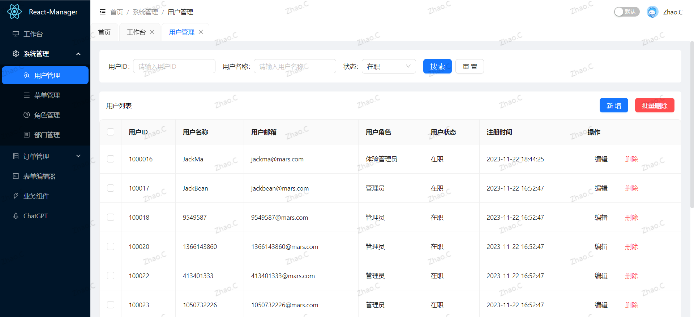
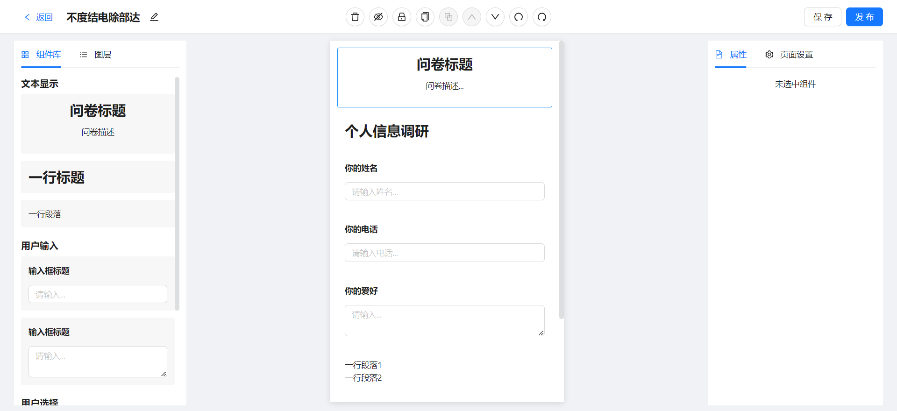

# React-Manager 🚀

### 介绍 📖

🚀🚀🚀 React Manager，基于 React18、React-Router v6、React-Hooks、zustand && dnd-kit、TypeScript、Vite、Ant-Design 开源的一套后台管理框架。

### 一、在线预览地址 👀

- Link(可能需要翻墙)：https://react-manager.vercel.app

### 二、Git 仓库地址 (欢迎 Star⭐)

- GitHub：https://github.com/zczhao1992/react-manager

### 三、🔨🔨🔨 项目功能

- 🚀 采用最新技术找开发：React18、React-Router v6、React-Hooks、TypeScript、Vite
- 🚀 采用 Vite 作为项目开发、打包工具
- 🚀 整个项目集成了 TypeScript
- 🚀 使用 zustand 做状态管理 一个巨好用的状态管理
- 🚀 使用 TypeScript 对 Axios 二次封装 （错误拦截、常用请求封装、全局请求 Loading、取消重复请求…）
- 🚀 使用 Antd 组件、支持暗黑模式
- 🚀 使用 自定义高阶组件 进行路由权限拦截（403 页面）、页面和按钮权限配置
- 🚀 支持 React-Router v6 路由懒加载配置、菜单手风琴模式、无限级菜单、多标签页、面包屑导航
- 🚀 使用 Prettier 统一格式化代码，集成 Eslint、Stylelint 代码校验规范（项目规范配置）
- 🚀 支持 低代码表单编辑器，支持拖拉拽、设置属性、撤销重做(有bug)

### 四、安装使用步骤 📑

- **Clone：**

```text
# GitHub
git clone https://github.com/zczhao1992/react-manager.git
```

- **Install：**

```text
npm install
cnpm install

# npm install 安装失败，请升级 nodejs 到 16 以上，或尝试使用以下命令：
npm install --registry=https://registry.npm.taobao.org
```

- **Run：**

```text
npm run dev
```

- **Build：**

```text
# 开发环境
npm run build:dev

# 测试环境
npm run build:test

# 生产环境
npm run build:pro
```

### 五、项目截图

#### 1、首页：


#### 2、列表页：



#### 3、表单编辑器：




### 六、文件资源目录 📚

```text
Hooks-Admin
├─ public                 # 静态资源文件（忽略打包）
├─ src
│  ├─ _mock               # mock数据
│  ├─ api                 # API 接口管理
│  ├─ assets              # 静态资源文件
│  ├─ components          # 全局组件
│  ├─ config              # 全局配置项
│  ├─ hooks               # 常用 Hooks
│  ├─ layouts             # 框架布局
│  ├─ router              # 路由管理
│  ├─ store               # 状态
│  ├─ styles              # 全局样式
│  ├─ types               # 全局 ts 声明
│  ├─ utils               # 工具库
│  ├─ views               # 项目所有页面
│  ├─ App.tsx             # 入口页面
│  ├─ main.tsx            # 入口文件
│  └─ vite-env.d.ts       # vite 声明文件
├─ .editorconfig          # 编辑器配置（格式化）
├─ .env.development       # 开发环境配置
├─ .env.production        # 生产环境配置
├─ .env.test              # 测试环境配置
├─ .eslintrc.js           # Eslint 校验配置
├─ .gitignore             # git 提交忽略
├─ .prettierrc.js         # prettier 配置
├─ index.html             # 入口 html
├─ package-lock.json      # 依赖包包版本锁
├─ package.json           # 依赖包管理
├─ README.md              # README 介绍
├─ tsconfig.json          # typescript 全局配置
├─ typing.d.ts            # 全局类型
└─ vite.config.ts         # vite 配置
```
